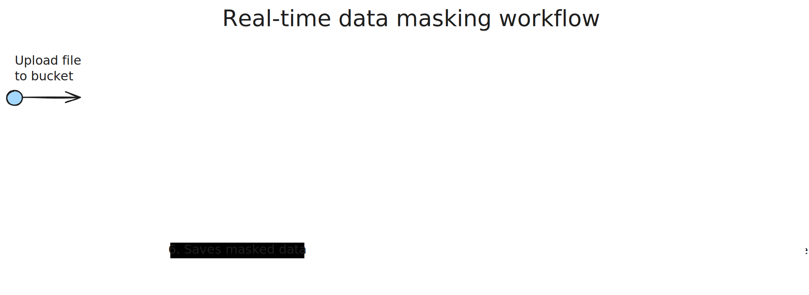

# Real-time sensitive data masking workflow

This small repo contains the infrastructure written in **CDK TypeScript** as well as the application code (also written in TypeScript).

## Architecture

The stack contains all resources displayed in the diagram:

